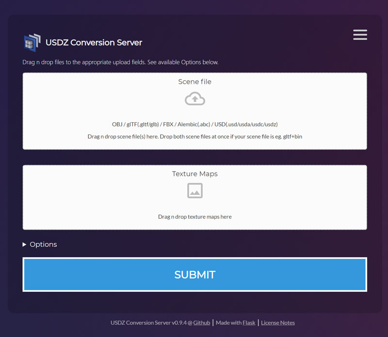

<!-- PROJECT SHIELDS -->
<!--
*** I'm using markdown "reference style" links for readability.
*** Reference links are enclosed in brackets [ ] instead of parentheses ( ).
*** See the bottom of this document for the declaration of the reference variables
*** for contributors-url, forks-url, etc. This is an optional, concise syntax you may use.
*** https://www.markdownguide.org/basic-syntax/#reference-style-links
-->
[![MIT License][license-shield]][license-url]

<!-- PROJECT LOGO -->
<br />
<p align="center">
  <a href="https://github.com/tappi287/usdzconvert_webui">
    
  </a>

  <h3 align="center">USDZconverter web ui</h3>

  <p align="center">
    Web interface to convert 3d content to usdz format
    <br />
  </p>
</p>


<!-- TABLE OF CONTENTS -->
## Table of Contents

* [About the Project](#about-the-project)
  * [Built With](#built-with)
* [Getting Started](#getting-started)
  * [Prerequisites](#prerequisites)
  * [Installation](#installation)
* [Usage](#usage)
* [License](#license)
* [Acknowledgements](#acknowledgements)


<!-- ABOUT THE PROJECT -->
## About The Project
<p align="center">
    
</p>
Web service aiming to provide a GUI across a local network for converting 3d content to usd/usdc/usda/usdz formats. The application adds useful defaults and some server side scene post processing to help you get to the desired output.

Useful if you just need a local usdz converter and do not want to share your assets with some cloud service or built USD from scratch.


### Built With

* [flask](https://palletsprojects.com/p/flask/)
* [waitress](https://docs.pylonsproject.org/projects/waitress/en/stable/)
* [OpenUSD](https://graphics.pixar.com/usd/)
* [usdpython_0.62](https://developer.apple.com/augmented-reality/quick-look/)
* [usdzconvert_windows](https://github.com/tappi287/usdzconvert_windows)


<!-- GETTING STARTED -->
## Getting Started

For Windows simply grab the latest [release](https://github.com/tappi287/usdzconvert_webui/releases). Required binaries will be downloaded on first run.

### Prerequisites

On Unix, tested with Ubuntu 18.04 WSL, you need to have a python3(preferably 3.8) as well as a python2.7 interpreter installed. The conversion scripts need numpy and pillow. The web ui can be setup using pipenv:
* Unix
```sh
python2.7 -m pip install --user numpy
python2.7 -m pip install --user pillow
python3 -m pip install --user pipenv
```

### Installation
* Windows
    1. Grab the latest [release](https://github.com/tappi287/usdzconvert_webui/releases)
    2. Execute the installer, pre-built USD binaries will be downloaded from [this repository](https://github.com/tappi287/usdzconvert_windows) on first run

* Unix
    1. Clone the usdzconvert_webui
        ```sh
        git clone https://github.com/tappi287/usdzconvert_webui.git
        cd usdzconvert_webui
        ```
    2. Inside the cloned directory setup a virtualenv with pipenv
        ```sh
        pipenv install
        ```
    3. Start a pipenv shell inside the new virtualenv
        ```sh
        pipenv shell
        ```
    4. Run the application
        ```sh
        python serve.py
        ```
        This will serve the app on all interfaces at 0.0.0.0:5000

<!-- USAGE EXAMPLES -->
## Usage
The first run will take some time. The install module will download [prebuilt USD binaries](https://github.com/tappi287/usdzconvert_windows) including Apples usdzconvert(part of [usdpython](https://developer.apple.com/download/more/?=USDPython)).

Use the top right menu to navigate to the manual page with some useful information regarding the conversion of different formats.


<!-- LICENSE -->
## License
Distributed under the MIT License. See `LICENSE` for more information.


<!-- ACKNOWLEDGEMENTS -->
## Acknowledgements
This is an incomplete list of awesome free software used to create this app.
* [flask](https://palletsprojects.com/p/flask/)
* [waitress](https://docs.pylonsproject.org/projects/waitress/en/stable/)
* [OpenUSD](https://graphics.pixar.com/usd/)
* [usdpython_0.62](https://developer.apple.com/augmented-reality/quick-look/)
* [appdirs](https://github.com/ActiveState/appdirs)
* [jsonpickle](https://github.com/eoghanmurray/jsonpickle_prev)
* [paramiko](https://github.com/paramiko/paramiko)
* [ultrajson](https://github.com/esnme/ultrajson)
* [cryptography](https://github.com/pyca/cryptography)
* [PyNsist](https://pynsist.readthedocs.io/en/latest/)
* [Best-ReadMe-Template](https://github.com/tappi287/Best-README-Template)


<!-- MARKDOWN LINKS & IMAGES -->
<!-- https://www.markdownguide.org/basic-syntax/#reference-style-links -->

[license-shield]: https://img.shields.io/github/license/tappi287/usdzconvert_webui
[license-url]: https://github.com/tappi287/usdzconvert_webui/blob/master/LICENSE
[product-screenshot]: https://github.com/tappi287/usdzconvert_webui/blob/master/usdz_webui/static/img/screenshot.jpg
